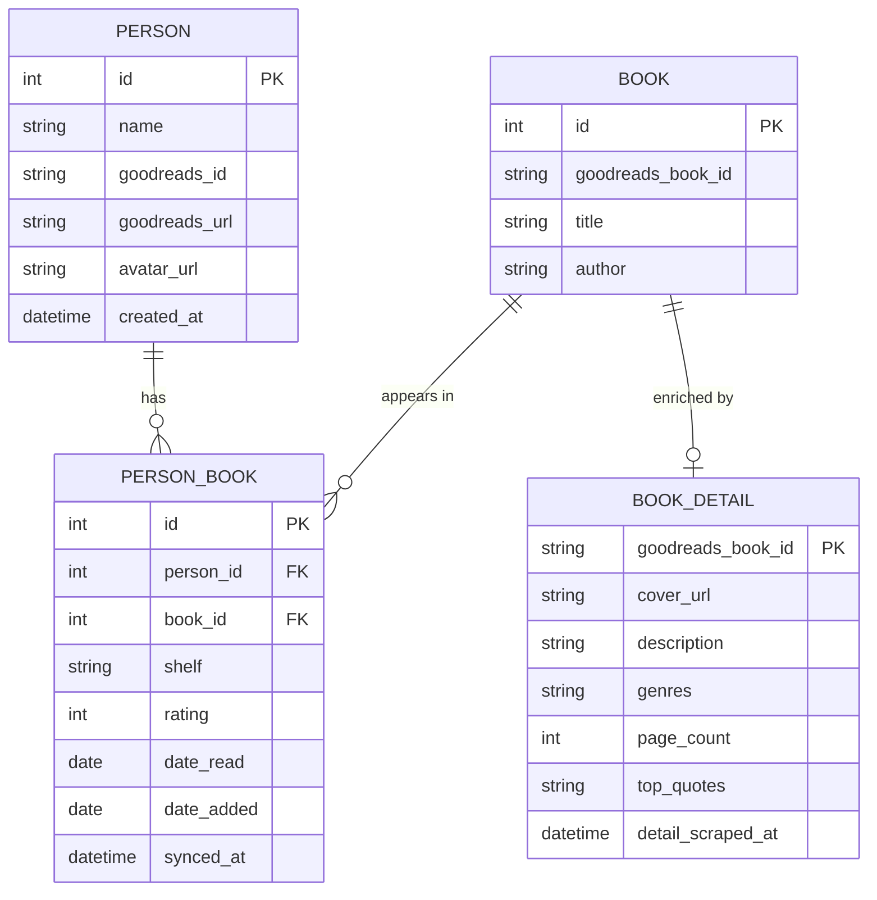

# ourshelf — Schema Design

## ER Diagram

## Table Notes

### `person`
Represents a Goodreads user — either the primary user or one of their friends. Populated when scraping a user's shelf or friend list.

### `book`
Core book identity — populated directly from the shelf list scrape. `goodreads_book_id` is extracted from the title link href (`/book/show/<id>`) and used as the dedup key across users — the same book shelved by multiple friends maps to one row.

**What the scraper gives us:** `goodreads_book_id`, `title`, `author`.

### `book_detail`
Enriched metadata scraped from each book's individual Goodreads page (`goodreads.com/book/show/<id>`). Populated in bulk after all shelves are scraped. `genres` and `top_quotes` are stored as JSON lists.

**Scraped from book page:** cover image, description, genres, page count.
**Scraped from quotes page** (`/work/quotes/<work_id>`)**:** top 5 quotes.

### `person_book`
The junction table capturing a person's relationship to a book. `shelf` mirrors Goodreads shelf values:
- `read`
- `currently-reading`
- `to-read`

`rating` is 1–5 (null if unrated). `date_added` and `date_read` come directly from the shelf list scrape. `synced_at` tracks when the row was last refreshed.

---

## Scraper → Schema Mapping

| Scraper field | Source | Table |
|---|---|---|
| `goodreads_book_id` | `td.field.title a` href (`/book/show/<id>`) | `book.goodreads_book_id` |
| `title` | `td.field.title a` | `book.title` |
| `author` | `td.field.author a` | `book.author` |
| `shelf` | shelf URL param | `person_book.shelf` |
| `rating` | `.staticStars span[class*='p']` | `person_book.rating` |
| `date_read` | `td.field.date_read .value` | `person_book.date_read` |
| `date_added` | `td.field.date_added .value` | `person_book.date_added` |
| `cover_url` | `[data-testid='coverImage']` src | `book_detail.cover_url` |
| `description` | `[data-testid='description']` | `book_detail.description` |
| `genres` | `[data-testid='genresList'] .Button__labelItem` | `book_detail.genres` (JSON list) |
| `page_count` | `[data-testid='pagesFormat']` | `book_detail.page_count` |
| `top_quotes` | `/work/quotes/<work_id>` `.quoteText` | `book_detail.top_quotes` (JSON list, max 5) |

---

## Open Questions

- Should we add a `FRIENDSHIP` table (`person_id` → `friend_id`) to model the social graph explicitly? This would let us query "show me books read by at least 2 of my friends" without re-scraping each time.
- Should `book_detail` be populated eagerly (all books, background job) or lazily (on first view)?
